# CONSULTAS

## ( 1 )CONSULTAS SOBRE UNA TABLA

### Devuelve un listado con todos los pedidos que se han realizado. Los pedidos deben estar ordenados por la fecha de realización, mostrando en primer lugar los pedidos más recientes.
```sql
select * from pedido
ORDER BY fecha desc;
```
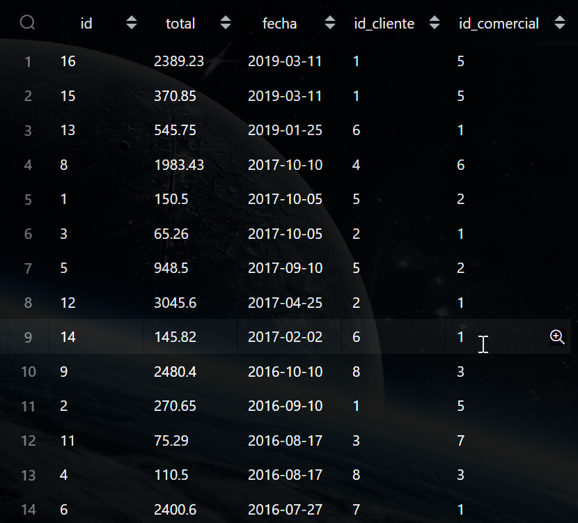

### Devuelve todos los datos de los dos pedidos de mayor valor.
```sql
SELECT *
FROM pedido
WHERE total IN (
    SELECT DISTINCT total
    FROM pedido
    ORDER BY total DESC
    LIMIT 2
);
```

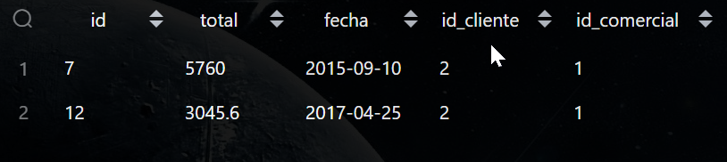

### Devuelve un listado con los identificadores de los clientes que han realizado algún pedido. Tenga en cuenta que no debe mostrar identificadores que estén repetidos.
```sql
select distinct pedido.id_cliente 
as "Clientes que han hecho pedidos" 
from pedido;
```
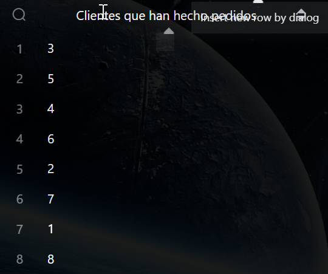

### Devuelve un listado de todos los pedidos que se realizaron durante el año 2017, cuya cantidad total sea superior a 500€.
```sql
select fecha 
from pedido
where pedido.fecha 
BETWEEN '2017-1-1' and '2017-12-31';
```

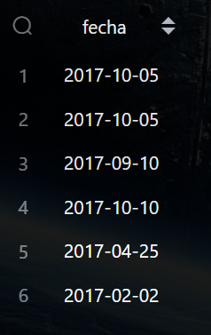

### Devuelve un listado con el nombre y los apellidos de los comerciales que tienen una comisión entre 0.05 y 0.11.
```sql
select comercial.nombre || ' ' || comercial.apellido1 || ' ' || comercial.apellido2 
as "Nombre y apellido", comisión from comercial
where comisión BETWEEN '0.05' and '0.11'
ORDER BY comisión asc;
```

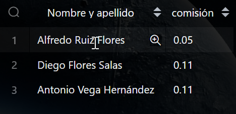

### Devuelve el valor de la comisión de mayor valor que existe en la tabla comercial.
```sql
select max(comisión) as "comisión de mayor valor" from comercial;
```

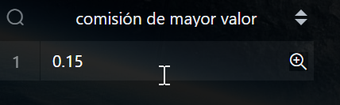

### Devuelve el identificador, nombre y primer apellido de aquellos clientes cuyo segundo apellido no es NULL. El listado deberá estar ordenado alfabéticamente por apellidos y nombre.
```sql
SELECT id, nombre || ' ' || apellido1 as "nombre y apellido"
from cliente
WHERE apellido2 is not null;
```

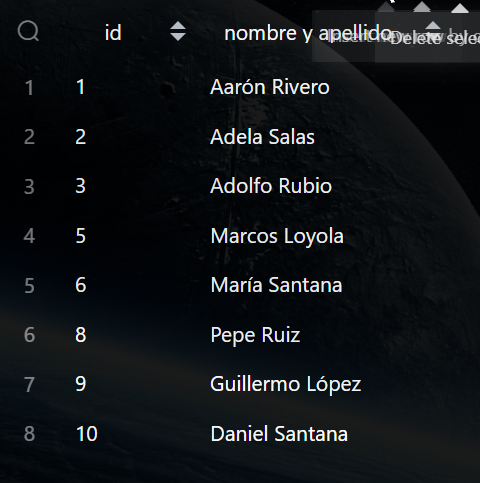

### Devuelve un listado de los nombres de los clientes que empiezan por A y terminan por n y también los nombres que empiezan por P. El listado deberá estar ordenado alfabéticamente.
```sql
select nombre
from cliente
where nombre like 'A%n'
or nombre like 'P%'
order by nombre asc;
```


### Devuelve un listado de los nombres de los clientes que no empiezan por A. El listado deberá estar ordenado alfabéticamente.
```sql
select nombre
from cliente
where nombre not like 'A%'
order by nombre asc;
```


### Devuelve un listado con los nombres de los comerciales que terminan por el o o. Tenga en cuenta que se deberán eliminar los nombres repetidos.
```sql
select DISTINCT nombre
from comercial
where nombre like '%o';
```


## ( 2 ) CONSULTAS MULTITABLAS(COMPOSICIÓN INTERNA)

### Devuelve un listado con el identificador, nombre y los apellidos de todos los clientes que han realizado algún pedido. El listado debe estar ordenado alfabéticamente y se deben eliminar los elementos repetidos.
```sql
select DISTINCT cliente.id,cliente.nombre,cliente.apellido1|| ' ' ||cliente.apellido2 as "apellidos"
from cliente
inner join pedido on cliente.id=pedido.id_cliente
ORDER BY cliente.nombre asc;
```

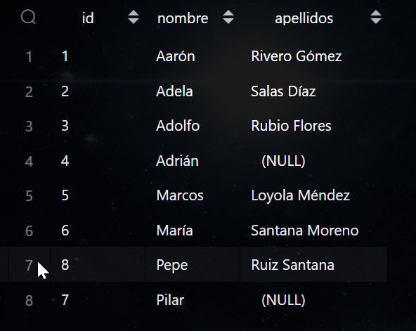

### Devuelve un listado que muestre todos los pedidos que ha realizado cada cliente. El resultado debe mostrar todos los datos de los pedidos y del cliente. El listado debe mostrar los datos de los clientes ordenados alfabéticamente.
```sql
select DISTINCT cliente.id,cliente.nombre,cliente.apellido1|| ' ' ||cliente.apellido2 as "apellidos",
cliente.ciudad,cliente.categoría,
pedido.*
from cliente
inner join pedido on cliente.id=pedido.id_cliente
ORDER BY cliente.nombre asc;
```

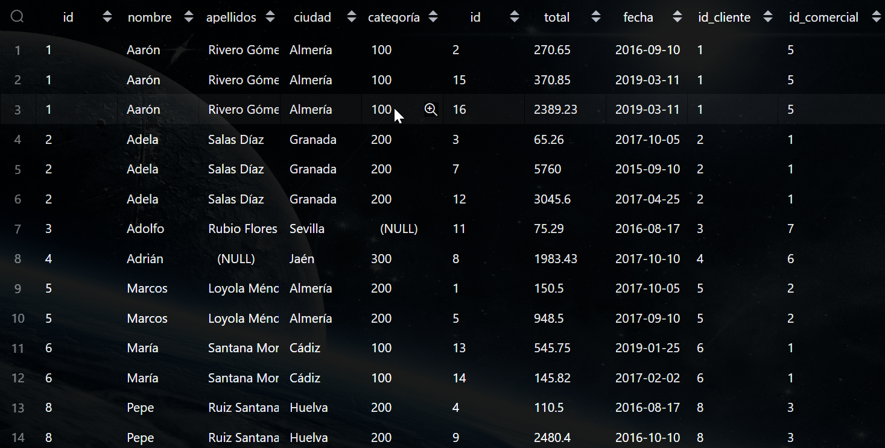

### Devuelve un listado que muestre todos los pedidos en los que ha participado un comercial. El resultado debe mostrar todos los datos de los pedidos y de los comerciales. El listado debe mostrar los datos de los comerciales ordenados alfabéticamente.
```sql
select DISTINCT comercial.nombre,comercial.apellido1 || ' ' || comercial.apellido2 as "apellidos",
pedido.*,comercial.comisión
from comercial
inner join pedido on comercial.id=pedido.id_comercial
ORDER BY comercial.nombre asc;
```

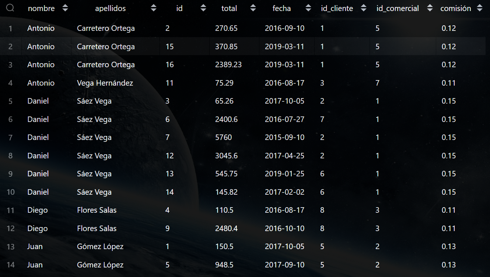

### Devuelve un listado que muestre todos los clientes, con todos los pedidos que han realizado y con los datos de los comerciales asociados a cada pedido.
```sql
select DISTINCT cliente.id as "id cliente",
cliente.nombre || ' ' || cliente.apellido1 as "nombre cliente",
pedido.*,comercial.nombre || ' ' || comercial.apellido1 || ' ' || comercial.apellido2 as "nombre completo comercial"
from cliente
inner join pedido on cliente.id=pedido.id_cliente
inner join comercial on comercial.id=pedido.id_comercial;
```

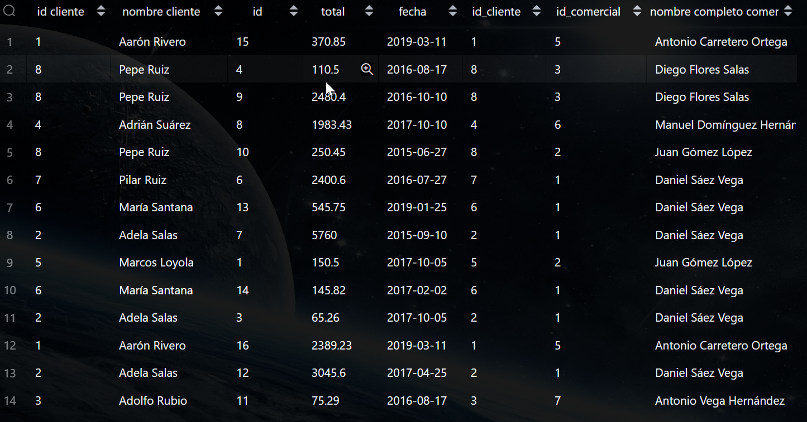

### Devuelve un listado de todos los clientes que realizaron un pedido durante el año 2017, cuya cantidad esté entre 300 € y 1000 €.
```sql
select distinct cliente.id as "id cliente",
cliente.nombre || ' ' || cliente.apellido1 as "nombre cliente",
pedido.fecha as "fecha del pedido",
pedido.total as "cantidad del pedido"
from cliente
inner join pedido on cliente.id=pedido.id_cliente
where pedido.fecha 
BETWEEN '2017-1-1' and '2017-12-31'
and pedido.total
BETWEEN 300 and 1000;
```


### Devuelve el nombre y los apellidos de todos los comerciales que ha participado en algún pedido realizado por María Santana Moreno.
```sql
pedido.*,
comercial.nombre || ' ' || comercial.apellido1 || ' ' || comercial.apellido2 as "nombre completo comercial",
cliente.nombre || ' ' || cliente.apellido1 as "nombre cliente" 
from comercial
inner join pedido on comercial.id=pedido.id_comercial
inner join cliente on cliente.id=pedido.id_cliente
where cliente.nombre ilike 'María'
and cliente.apellido1 ilike 'Santana'
and cliente.apellido2 ilike 'Moreno'; 
```

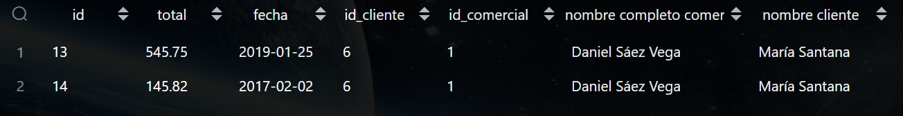

### Devuelve el nombre de todos los clientes que han realizado algún pedido con el comercial Daniel Sáez Vega.
```sql
pedido.*,
comercial.nombre || ' ' || comercial.apellido1 || ' ' || comercial.apellido2 as "nombre completo comercial",
cliente.nombre || ' ' || cliente.apellido1 as "nombre cliente" 
from comercial
inner join pedido on comercial.id=pedido.id_comercial
inner join cliente on cliente.id=pedido.id_cliente
where comercial.nombre ilike 'daniel'
and comercial.apellido1 ilike 'sáez'
and comercial.apellido2 ilike 'vega'; 
```

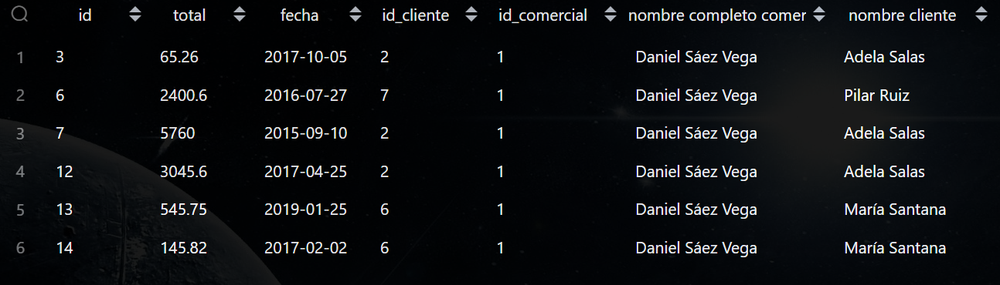

## ( 3 )CONSULTAS MULTITABLAS(COMPOSICIÓN EXTERNA)

### Devuelve un listado con todos los clientes junto con los datos de los pedidos que han realizado. Este listado también debe incluir los clientes que no han realizado ningún pedido. El listado debe estar ordenado alfabéticamente por el primer apellido, segundo apellido y nombre de los clientes.
```sql
select DISTINCT
cliente.*,
pedido.*
from cliente
left join pedido on cliente.id=pedido.id_cliente
left join comercial on comercial.id=pedido.id_comercial
ORDER BY cliente.apellido1 asc,cliente.apellido2 asc, cliente.nombre asc;
```

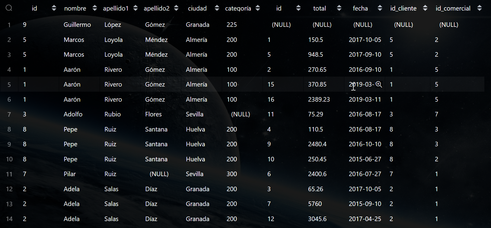

### Devuelve un listado con todos los comerciales junto con los datos de los pedidos que han realizado. Este listado también debe incluir los comerciales que no han realizado ningún pedido. El listado debe estar ordenado alfabéticamente por el primer apellido, segundo apellido y nombre de los comerciales.
```sql
select DISTINCT
comercial.*,
pedido.*
from comercial
left join pedido on comercial.id=pedido.id_comercial
left join cliente on cliente.id=pedido.id_cliente
ORDER BY comercial.apellido1 asc,comercial.apellido2 asc, comercial.nombre asc;
```

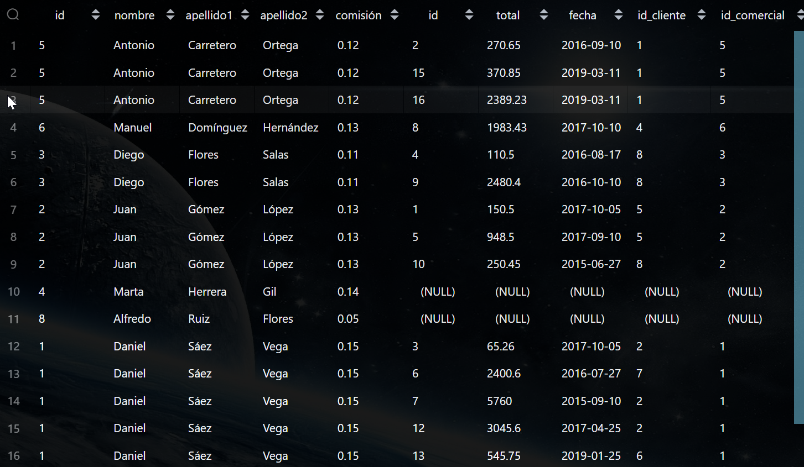

### Devuelve un listado que solamente muestre los clientes que no han realizado ningún pedido.
```sql
select DISTINCT
cliente.*,
pedido.*
from cliente
left join pedido on cliente.id=pedido.id_cliente
where pedido.id_cliente is null;
```

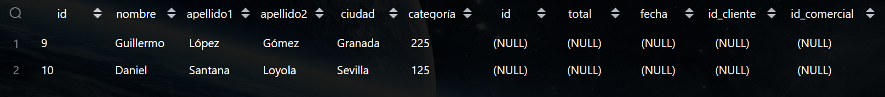

### Devuelve un listado que solamente muestre los comerciales que no han realizado ningún pedido.
```sql
select DISTINCT
comercial.id as "id comercial",
comercial.nombre || ' ' || comercial.apellido1 || ' ' || comercial.apellido2
as "nombre comercial completo",
pedido.*
from comercial
LEFT JOIN pedido on comercial.id=pedido.id_comercial
where pedido.id is null;
```

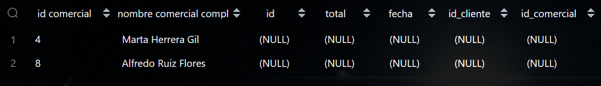

### Devuelve un listado con los clientes que no han realizado ningún pedido y de los comerciales que no han participado en ningún pedido. Ordene el listado alfabéticamente por los apellidos y el nombre. En en listado deberá diferenciar de algún modo los clientes y los comerciales.
```sql
select DISTINCT
comercial.id as "id comercial",
comercial.nombre as "nombre comercial",
comercial.apellido1 as "apellido1 comercial",
comercial.apellido2 as "apellido2 comercial",
cliente.id as "id cliente",
cliente.nombre as "nombre cliente",
cliente.apellido1 as "apellido1 cliente",
cliente.apellido2 as "apellido2 cliente",
pedido.id as "id pedido"
from cliente
full OUTER join pedido on cliente.id=pedido.id_cliente
full OUTER join comercial on comercial.id=pedido.id_comercial
where pedido.id_comercial is NULL
or pedido.id_cliente is NULL
order by comercial.nombre,comercial.apellido1,comercial.apellido2,
cliente.nombre,cliente.apellido1,cliente.apellido2 asc;
```

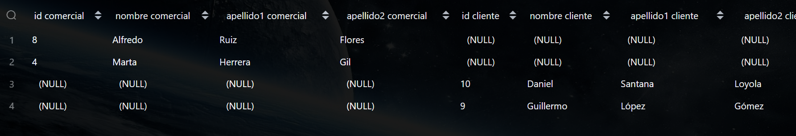

### ¿Se podrían realizar las consultas anteriores con NATURAL LEFT JOIN o NATURAL RIGHT JOIN? Justifique su respuesta.
```sql
esas no existen en postgrest las que existen son el outer y sí, si funcionan igual
```

## ( 4 )CONSULTAS RESUMEN

### Calcula la cantidad total que suman todos los pedidos que aparecen en la tabla pedido.
```sql
select round(sum(pedido.total)) as "cantidad total de pedidos"
from pedido;
```


### Calcula la cantidad media de todos los pedidos que aparecen en la tabla pedido.
```sql
select round(avg(pedido.total))
from pedido;
```

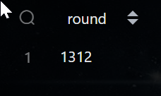

### Calcula el número total de comerciales distintos que aparecen en la tabla pedido.
```sql
SELECT COUNT(DISTINCT pedido.id_comercial)
FROM pedido;
```


### Calcula el número total de clientes que aparecen en la tabla cliente.
```sql
select count(id) from cliente;
```

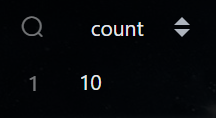

### Calcula cuál es la mayor cantidad que aparece en la tabla pedido.
```sql
select max(total) from pedido;
```

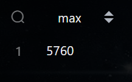

### Calcula cuál es la menor cantidad que aparece en la tabla pedido.
```sql
select min(total) from pedido;
```

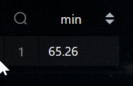

### Calcula cuál es el valor máximo de categoría para cada una de las ciudades que aparece en la tabla cliente.
```sql
select cliente.ciudad,
max(cliente.categoría) from cliente
group by cliente.ciudad;
```

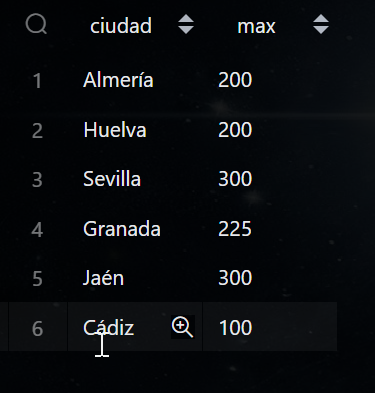

### Calcula cuál es el máximo valor de los pedidos realizados durante el mismo día para cada uno de los clientes. Es decir, el mismo cliente puede haber realizado varios pedidos de diferentes cantidades el mismo día. Se pide que se calcule cuál es el pedido de máximo valor para cada uno de los días en los que un cliente ha realizado un pedido. Muestra el identificador del cliente, nombre, apellidos, la fecha y el valor de la cantidad.
```sql
select cliente.id,cliente.nombre, cliente.apellido1,
pedido.fecha,max(pedido.total)
from cliente
inner JOIN pedido on cliente.id=pedido.id_cliente
group by pedido.fecha,cliente.id
order by cliente.nombre asc;
```

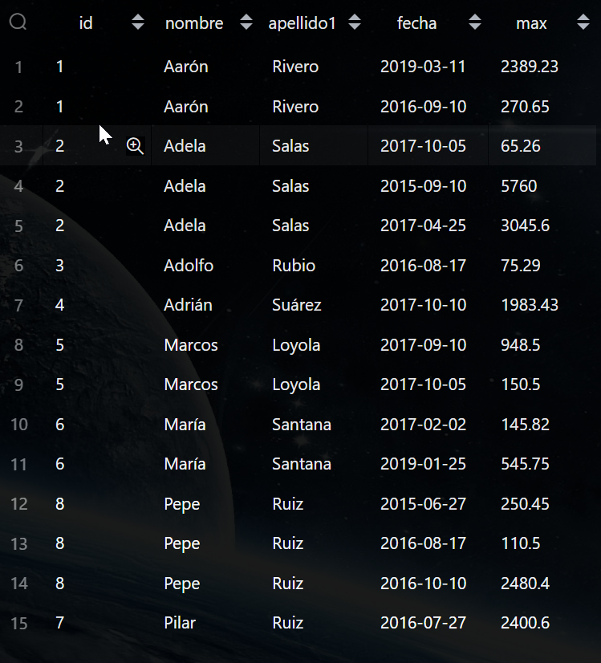

### Calcula cuál es el máximo valor de los pedidos realizados durante el mismo día para cada uno de los clientes, teniendo en cuenta que sólo queremos mostrar aquellos pedidos que superen la cantidad de 2000 €.
```sql
select pedido.fecha,cliente.id,cliente.nombre,cliente.apellido1,max(pedido.total)
from cliente
inner join pedido on cliente.id=pedido.id_cliente
group by pedido.fecha,cliente.id
HAVING max(pedido.total)>2000;
```

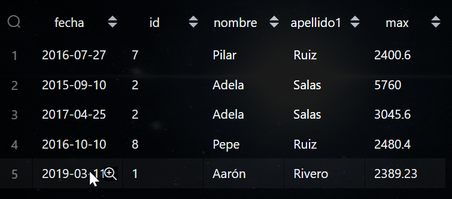

### Calcula el máximo valor de los pedidos realizados para cada uno de los comerciales durante la fecha 2016-08-17. Muestra el identificador del comercial, nombre, apellidos y total.
```sql
SELECT MAX(pedido.total) AS "maximo valor de los pedidos",
comercial.id, comercial.nombre, comercial.apellido1,
comercial.apellido2
FROM comercial
INNER JOIN pedido ON comercial.id = pedido.id_comercial
WHERE pedido.fecha = '2016-08-17'
GROUP BY comercial.id, comercial.nombre, comercial.apellido1,
comercial.apellido2;
```

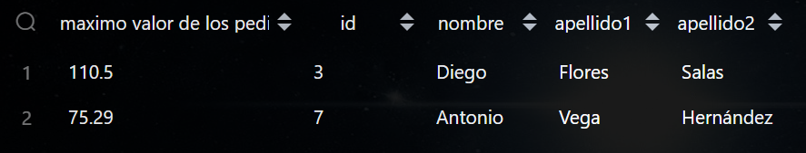

### Devuelve un listado con el identificador de cliente, nombre y apellidos y el número total de pedidos que ha realizado cada uno de clientes. Tenga en cuenta que pueden existir clientes que no han realizado ningún pedido. Estos clientes también deben aparecer en el listado indicando que el número de pedidos realizados es 0.
```sql
SELECT cliente.id, cliente.nombre, cliente.apellido1, cliente.apellido2,
       COALESCE(round(SUM(pedido.total)), 0) AS total_pedidos
FROM cliente
LEFT JOIN pedido ON cliente.id = pedido.id_cliente
GROUP BY cliente.id, cliente.nombre, cliente.apellido1, cliente.apellido2;
```

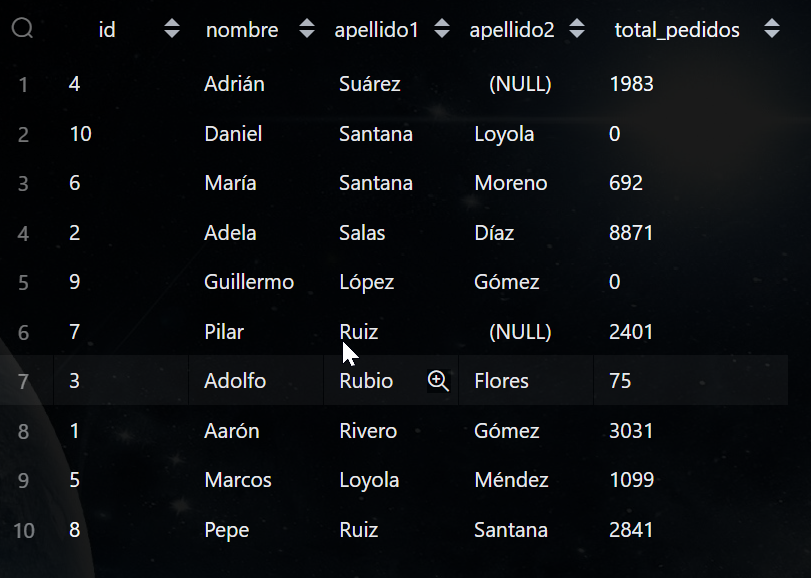

### Devuelve un listado con el identificador de cliente, nombre y apellidos y el número total de pedidos que ha realizado cada uno de clientes durante el año 2017.
```sql
SELECT cliente.id, cliente.nombre, cliente.apellido1, cliente.apellido2,
       COALESCE(ROUND(SUM(pedido.total)), 0) AS "total pedidos",
       EXTRACT(YEAR FROM pedido.fecha) as "Año"
FROM cliente
LEFT JOIN pedido ON cliente.id = pedido.id_cliente
WHERE EXTRACT(YEAR FROM pedido.fecha) = 2017
GROUP BY cliente.id, cliente.nombre, cliente.apellido1, cliente.apellido2
,pedido.fecha;
```

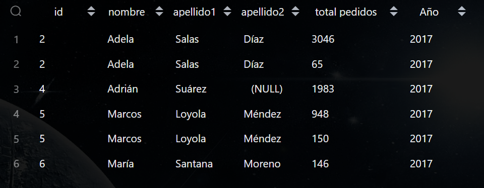

### Devuelve un listado que muestre el identificador de cliente, nombre, primer apellido y el valor de la máxima cantidad del pedido realizado por cada uno de los clientes. El resultado debe mostrar aquellos clientes que no han realizado ningún pedido indicando que la máxima cantidad de sus pedidos realizados es 0. Puede hacer uso de la función IFNULL.
```sql
SELECT 
    cliente.id,
    cliente.nombre,
    cliente.apellido1,
    COALESCE(MAX(pedido.total), 0) AS "maxima cantidad"
FROM 
    cliente
LEFT JOIN 
    pedido ON cliente.id = pedido.id_cliente
GROUP BY 
    cliente.id, 
    cliente.nombre, 
    cliente.apellido1;
```

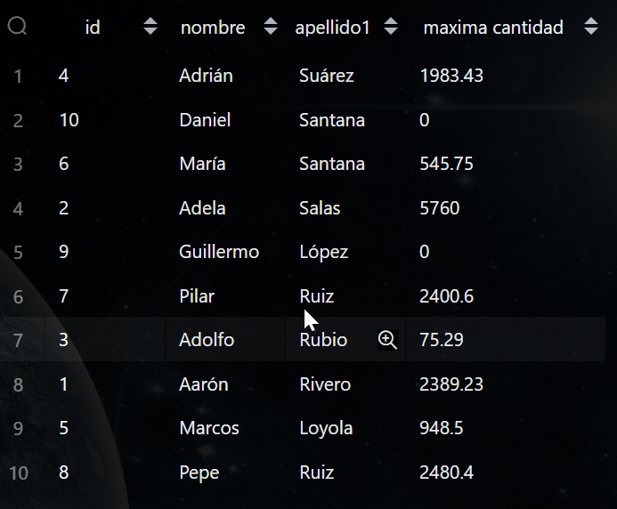

### Devuelve cuál ha sido el pedido de máximo valor que se ha realizado cada año.
```sql
SELECT DISTINCT ON (EXTRACT(YEAR FROM fecha)) 
    EXTRACT(YEAR FROM fecha) AS "Año",
    total AS "Máximo valor del pedido",
    id AS "ID del pedido"
FROM pedido
ORDER BY EXTRACT(YEAR FROM fecha), total DESC;
```

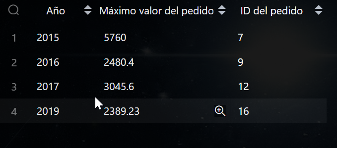

### Devuelve el número total de pedidos que se han realizado cada año.
```sql
SELECT
    EXTRACT(YEAR FROM pedido.fecha) AS "Año",
    COUNT(id) AS "total pedidos"
FROM
    pedido
GROUP BY
    EXTRACT(YEAR FROM pedido.fecha);
```

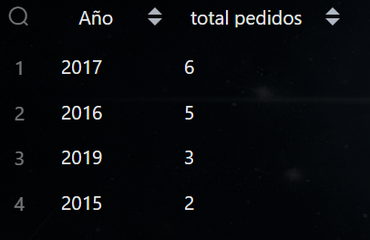

## ( 5 ) CON OPERADORES BASICOS DE COMPARACIÓN

### Devuelve un listado con todos los pedidos que ha realizado Adela Salas Díaz. (Sin utilizar INNER JOIN).
```sql
select * from pedido
where pedido.id_cliente=(
    select cliente.id from cliente
    where nombre='Adela');
```

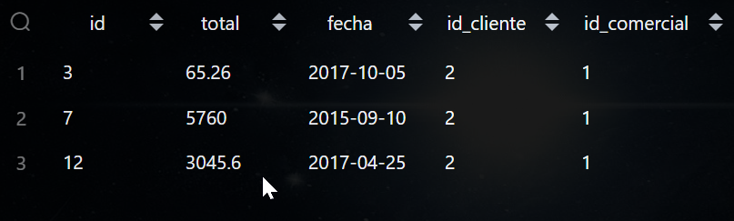

### Devuelve el número de pedidos en los que ha participado el comercial Daniel Sáez Vega. (Sin utilizar INNER JOIN).
```sql
select * from pedido
where pedido.id_comercial=(
    select comercial.id from comercial
    where nombre='Daniel'
);
```

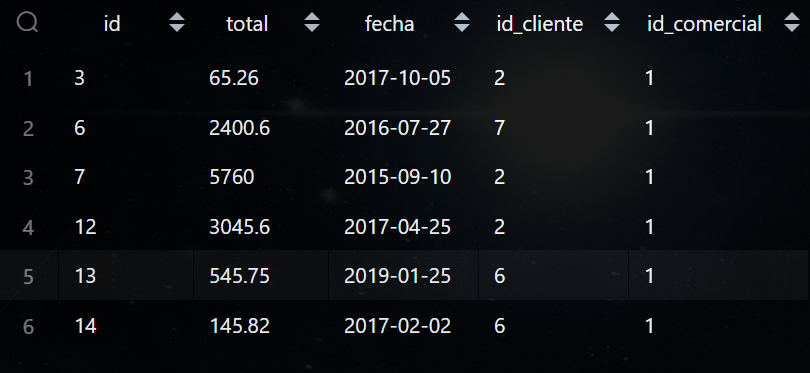

### Devuelve los datos del cliente que realizó el pedido más caro en el año 2019. (Sin utilizar INNER JOIN)
```sql
SELECT *
FROM cliente
WHERE cliente.id = (
    SELECT pedido.id_cliente
    FROM pedido
    WHERE EXTRACT(YEAR FROM fecha) = 2019
    ORDER BY total DESC
    LIMIT 1
);
```

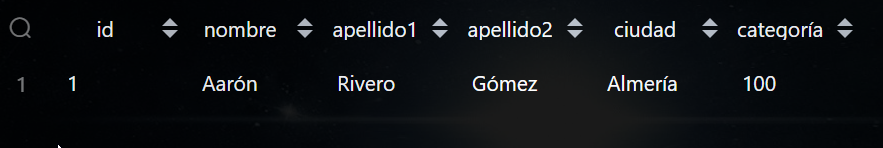

### Devuelve la fecha y la cantidad del pedido de menor valor realizado por el cliente Pepe Ruiz Santana.
```sql
select fecha, min(total) as "pedido menor valor" from pedido
where pedido.id_cliente=(
    select cliente.id from cliente
    where cliente.nombre='Pepe'
)
GROUP BY fecha
order by min(total) asc
limit 1
;
```


### Devuelve un listado con los datos de los clientes y los pedidos, de todos los clientes que han realizado un pedido durante el año 2017 con un valor mayor o igual al valor medio de los pedidos realizados durante ese mismo año.
```sql
select distinct cliente.*,
pedido.*
from cliente
inner join pedido on cliente.id=pedido.id_cliente
where extract(year from pedido.fecha)='2017'
and pedido.total>=(SELECT AVG(p.total)
    FROM pedido p
    WHERE EXTRACT(YEAR FROM p.fecha) = '2017');
```

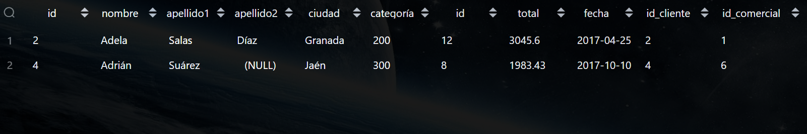

## ( 6 ) SUBCONSULTAS CON ALL Y ANY

### Devuelve el pedido más caro que existe en la tabla pedido si hacer uso de MAX, ORDER BY ni LIMIT.
```sql
SELECT *
FROM pedido p1
WHERE total >= ALL (
    SELECT total
    FROM pedido p2
    WHERE p1.id <> p2.id
);
```

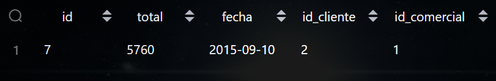

### Devuelve un listado de los clientes que no han realizado ningún pedido. (Utilizando ANY o ALL).
```sql
SELECT *
FROM cliente c
WHERE c.id <> ALL (
    SELECT p.id_cliente
    FROM pedido p
);


SELECT *
FROM cliente
WHERE id NOT IN (
    SELECT id_cliente
    FROM pedido
);
```

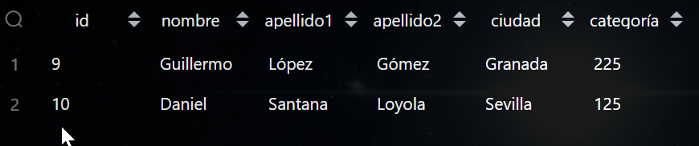

### Devuelve un listado de los comerciales que no han realizado ningún pedido. (Utilizando ANY o ALL).
```sql
select *
from comercial c
where c.id <> all(
    select p.id_comercial
    from pedido p
);
```

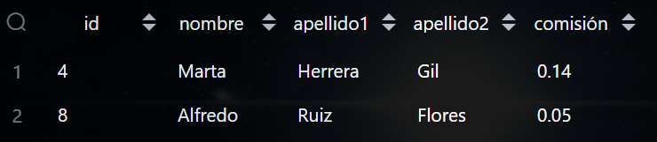

## ( 7 ) SUBCONSULTAS CON IN Y NOT IN

### Devuelve un listado de los clientes que no han realizado ningún pedido. (Utilizando IN o NOT IN).
```sql
select * from cliente
where id not in(
    select id_cliente from pedido
);
```

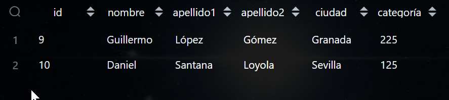

### Devuelve un listado de los comerciales que no han realizado ningún pedido. (Utilizando IN o NOT IN).
```sql
select * from comercial
where id not in(
    select id_comercial from pedido
);
```

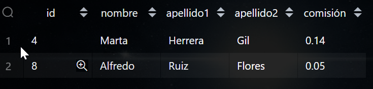

## ( 8 ) SUBCONSULTAS CON EXISTS Y NOT EXISTS

### Devuelve un listado de los clientes que no han realizado ningún pedido. (Utilizando EXISTS o NOT EXISTS).
```sql
SELECT *
FROM cliente c
WHERE NOT EXISTS (
    SELECT 1
    FROM pedido p
    WHERE p.id_cliente = c.id
);
```

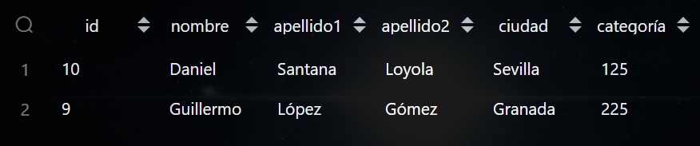

### Devuelve un listado de los comerciales que no han realizado ningún pedido. (Utilizando EXISTS o NOT EXISTS).
```sql
SELECT *
FROM comercial cm
WHERE NOT EXISTS (
    SELECT 1
    FROM pedido p
    WHERE p.id_comercial = cm.id
);
```

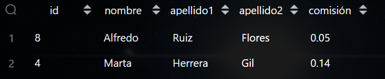